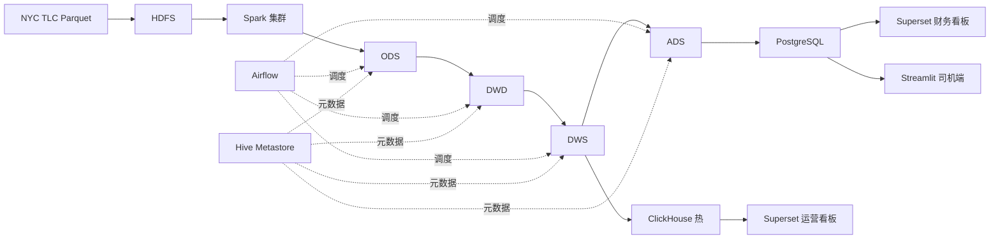
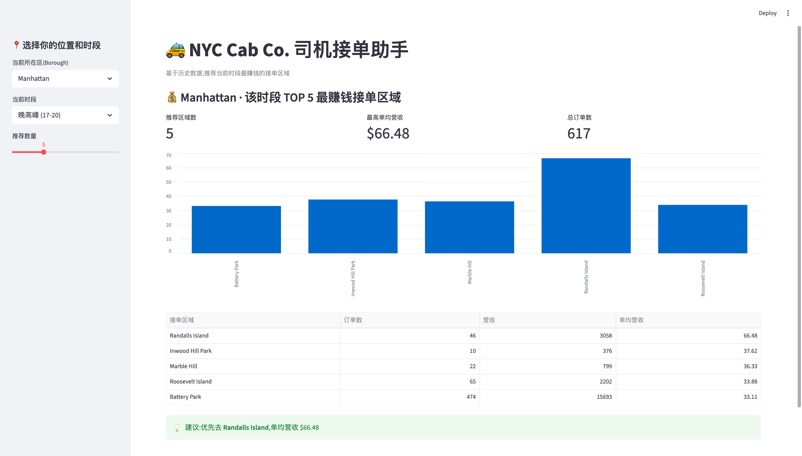

# 🚕 NYC 出租车智能运营平台

> 企业级大数据全栈项目 · 覆盖 **存储 → 计算 → 数仓 → OLAP → 调度 → BI → 应用** 全链路
> NYC Yellow Taxi 2024 Q1 · 955 万行 · 全栈 Docker Compose 一键部署(架构支持扩展至 3 年全量)

---

## 📊 核心优化成果(19 项量化,均为实测)

| 类别 | 优化项 | 优化前 → 优化后 | 提升 |
|------|--------|----------------|------|
| **存储** | CSV → Parquet 查询 | 3.00s → 0.25s | **12.2x** |
| **存储** | Parquet 文件压缩 | 308MB → 58MB | **5.3x** |
| **存储** | Zstd vs Snappy | — | 空间 **-24%** + 读取 **+42%** |
| **存储** | 分区裁剪 | 0.72s → 0.26s | **2.77x** |
| **存储** | 小文件治理 | 2.31s → 0.11s | **20.3x** |
| **计算** | Broadcast Join | 0.87s → 0.23s | **3.75x** |
| **计算** | AQE 动态合并 | 2.88s → 0.75s | **3.82x** |
| **计算** | CBO Join Reorder | 0.64s → 0.37s | **1.71x** |
| **倾斜** | 加盐法(最长 Task) | 855ms → 138ms | **6.2x** |
| **倾斜** | AQE Skew Join | 2.17s → 0.75s | **2.89x** |
| **查询** | DWS 预聚合行数 | 9.23M → 20k | **452x** |
| **查询** | 窗口函数 vs 自连接 | 0.54s → 0.32s | **1.70x** |
| **查询** | HyperLogLog 近似 | 2.28s → 0.71s | **3.20x**(误差 2.33%) |
| **OLAP** | ClickHouse vs Spark | 1.805s → 0.187s | **9.6x** |
| **索引** | PG 覆盖/部分索引 | 6.10ms → 0.024ms | **254x**(IO 680x↓) |

> 完整指标 + 业务洞察 + 13 个工程坑 → [`benchmarks/_summary.md`](benchmarks/_summary.md)

---

## 🏗️ 技术架构



| 层级 | 组件 |
|------|------|
| 存储 | HDFS + Parquet(Snappy/Zstd) |
| 计算 | Spark 3.4(PySpark + Spark SQL) |
| 数仓 | Hive Metastore + ODS/DWD/DWS/ADS 四层 |
| 热 OLAP | ClickHouse(MergeTree) |
| 关系型 | PostgreSQL(B-Tree/覆盖/部分索引) |
| 调度 | Airflow(LocalExecutor) |
| BI | Apache Superset |
| 应用 | Streamlit |
| 容器 | Docker Compose(core / serving 分组启停) |

---

## 📈 看板与应用展示

### 运营看板(ClickHouse)


### 财务看板(PostgreSQL)


### 司机端推荐应用(Streamlit)


---

## 💡 业务洞察(数据团队价值)

| 洞察 | 数据 | 建议 |
|------|------|------|
| 早晚高峰不对称 | 早高峰订单仅晚高峰 **53%** | 晚高峰重点排班 |
| 机场金矿 | 机场行程 9.5% / 客单价 $77 vs 市区 $22(**3.5x**) | 机场专车产品 |
| 黑色周日 | 2024-03-31 Manhattan 营收 -25~35%,仅 Penn Station +30.9% | 异常事件归因 |
| 区域打车密度 | Manhattan 54%(高密度)vs Queens 93%(稀疏) | 差异化供给策略 |
| 2024 Q1 总营收 | **$2.53 亿** | — |

---

## 🚀 快速启动

```bash
# 1. 启动核心服务(常驻):HDFS + Spark + Hive + PostgreSQL + Jupyter
docker compose -f docker/docker-compose.core.yml up -d

# 2. 按需启动服务层:ClickHouse / Airflow / Superset / Streamlit
docker compose -f docker/docker-compose.serving.yml up -d
```

| 服务 | 入口 |
|------|------|
| HDFS NameNode | http://localhost:9870 |
| Spark Master | http://localhost:8080 |
| Jupyter | http://localhost:8888 |
| ClickHouse | http://localhost:8123 |
| Airflow | http://localhost:8081 |
| Superset | http://localhost:8088 |
| Streamlit 司机端 | http://localhost:8501 |

> 内存规划见 [`docs/RESOURCE_PLAN.md`](docs/RESOURCE_PLAN.md)(M5 32GB,core/serving 分组启停避免 OOM)

---

## 📚 文档导航

| 文档 | 内容 |
|------|------|
| [项目总览](docs/PROJECT_OVERVIEW.md) | 架构、业务背景、简历模板、20 道面试题 |
| [资源规划](docs/RESOURCE_PLAN.md) | 内存预算、分组启停、OOM 应急 |
| [学习路径](docs/LEARNING_PATH.md) | 阶段依赖、核心概念、能力 checklist |
| [指标总账](benchmarks/_summary.md) | 19 项量化 + 5 洞察 + 13 工程坑 |
| [项目复盘](docs/STAGE_13_项目复盘与简历输出.md) | 故事线、面试准备、扩展方向 |

### 分阶段文档(13 个)
S01 [环境搭建](docs/STAGE_01_环境搭建.md) ·
S02 [ODS 接入](docs/STAGE_02_数据接入与ODS层.md) ·
S03 [存储优化](docs/STAGE_03_存储层优化.md) ·
S04 [DWD 清洗](docs/STAGE_04_DWD层与数据清洗.md) ·
S05 [计算优化](docs/STAGE_05_计算层深度优化.md) ·
S06 [数据倾斜](docs/STAGE_06_数据倾斜实战.md) ·
S07 [DWS 优化](docs/STAGE_07_DWS层与查询优化.md) ·
S08 [ADS+索引](docs/STAGE_08_ADS层与PG索引.md) ·
S09 [ClickHouse](docs/STAGE_09_ClickHouse冷热分层.md) ·
S10 [Airflow](docs/STAGE_10_Airflow调度编排.md) ·
S11 [Superset](docs/STAGE_11_Superset看板.md) ·
S12 [Streamlit](docs/STAGE_12_Streamlit司机应用.md) ·
S13 [复盘](docs/STAGE_13_项目复盘与简历输出.md)

---

## 🔧 工程亮点:13 个真实坑的诊断与修复

不是"跑通教程",而是踩过坑的真实工程:bitnami 镜像下架应急、Apple Silicon amd64 适配、PostgreSQL 15 与 Hive JDBC 认证冲突、Hive 入口脚本硬编码 bug、上游 Parquet schema 隐式变更、**file:// 分布式路径陷阱**、ClickHouse user_files 沙箱…… 详见各 STAGE「踩坑实录」。

---

## ✅ 项目状态:13/13 阶段完成

全栈打通,五类用户(运营/财务/司机/数据/调度)全覆盖。
