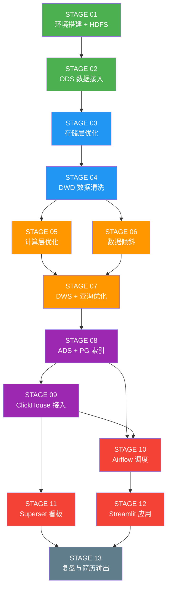

# LEARNING_PATH — 学习路径与能力图谱

> 这份文档帮你搞清楚"学什么顺序、学完能干什么、不懂时看哪里"

---

## 一、阶段依赖关系图

**颜色标注**：
- 🟢 绿色（S01-02）：地基，必须打稳
- 🔵 蓝色（S03-04）：存储与清洗，数仓的骨架
- 🟠 橙色（S05-07）：计算优化，项目的"肌肉"
- 🟣 紫色（S08-09）：多引擎架构，架构师视角
- 🔴 红色（S10-12）：工程化交付，让项目"活起来"
- ⚫ 灰色（S13）：价值沉淀

---

## 二、每阶段核心概念清单

### STAGE 01 — 环境搭建与 HDFS 入门

| 概念 | 一句话理解 | 为什么需要知道 |
|------|-----------|-------------|
| Docker Compose | 用一个 YAML 文件描述并启动多个容器 | 我们全栈都靠它部署 |
| HDFS NameNode | 图书馆的目录系统（只记位置，不存书）| 元数据管理的核心 |
| HDFS DataNode | 真正存书的书架（多个副本分散在多台机器）| 数据高可用的底层 |
| Block 块 | HDFS 存储文件的最小单位（默认 128MB）| 影响读写并行度 |
| 副本因子 | 每个块存几份（默认 3），坏一台不丢数据 | 数据可靠性设计 |
| Spark Master/Worker | Master 是调度员，Worker 是干活的 | Spark 集群架构必知 |

**学完能做到**：
- [ ] 从零部署 Docker Compose 多容器集群
- [ ] 用 HDFS CLI 上传/下载/查看文件
- [ ] 看懂 Spark Master Web UI（Worker 数量/内存）
- [ ] 解释 HDFS 副本机制如何保证高可用

---

### STAGE 02 — 数据接入与 ODS 层

| 概念 | 一句话理解 | 为什么需要知道 |
|------|-----------|-------------|
| ODS 层 | 数据仓库的"原料库"，原样保存原始数据 | 数据可追溯的基础 |
| Parquet | 列式存储格式，只读需要的列，比 CSV 快 10x+ | 所有优化的起点 |
| Spark Session | PySpark 的入口，类比 MySQL 的连接句柄 | 写 Spark 代码必知 |
| Schema 推断 | Spark 自动识别 CSV 列类型（可能出错）| 为什么要手动定义 schema |
| 分区写入 | 按某列的值分开存文件，查询时跳过无关分区 | 分区裁剪的基础 |
| Hive Metastore | 表的"户籍系统"，记录表名、列名、文件位置 | 让 Spark SQL 能直接用 |

**学完能做到**：
- [ ] 用 PySpark 读 CSV，写 Parquet
- [ ] 对比 CSV vs Parquet 查询耗时（实验 #1）
- [ ] 在 Hive Metastore 注册外部表
- [ ] 用 Spark SQL 查询 HDFS 上的 Parquet 文件

---

### STAGE 03 — 存储层优化

| 概念 | 一句话理解 | 为什么需要知道 |
|------|-----------|-------------|
| 分区裁剪（Partition Pruning）| 查 2024-01 只扫 2024-01 的文件夹 | 减少 IO，最直接的优化 |
| 分桶（Bucketing）| 按某列 Hash 分成固定数量的桶，Join 时消除 Shuffle | Join 优化的核心手段 |
| 压缩算法 | Snappy（快）、Zstd（压缩率高）、Gzip（通用）| 空间和速度的权衡 |
| 小文件问题 | 100 万个 1KB 文件比 1 个 1GB 文件更难管理 | NameNode 内存，Spark 任务数 |
| coalesce vs repartition | coalesce 减分区（窄依赖），repartition 重分区（宽依赖）| 控制输出文件数量 |

**学完能做到**：
- [ ] 设计合理的分区键（时间 + 区域）
- [ ] 对比 Snappy vs Zstd（实验 #2）
- [ ] 验证分区裁剪效果（实验 #3）
- [ ] 合并小文件，控制输出文件数量

---

### STAGE 04 — DWD 层与数据清洗

| 概念 | 一句话理解 | 为什么需要知道 |
|------|-----------|-------------|
| DWD 层 | 清洗后的明细层，每行是一次真实行程 | 所有分析的数据底座 |
| 数据清洗规则 | 负金额、零公里、超长行程 → 过滤或标记 | 垃圾进垃圾出原则 |
| 维度关联 | trip + taxi_zone_lookup → 区域名称 | Star Schema 思想 |
| 广播变量（Broadcast）| 小表发给每个 Executor，避免 Shuffle | 维表关联的标准做法 |
| UDF | User Defined Function，Python 函数注册给 Spark SQL 用 | 处理复杂业务逻辑 |

**学完能做到**：
- [ ] 写数据质量检测脚本（空值率、异常值统计）
- [ ] 实现 ODS→DWD 的 ETL Pipeline
- [ ] 关联维表，补全区域名称字段
- [ ] 理解并使用广播 Join

---

### STAGE 05 — 计算层优化

| 概念 | 一句话理解 | 为什么需要知道 |
|------|-----------|-------------|
| Catalyst 优化器 | Spark 的"查询翻译官"，自动优化你写的 SQL | 理解为什么 Spark SQL 快 |
| 谓词下推（Predicate Pushdown）| 把 WHERE 条件"推"到读文件阶段，早过滤早省钱 | 减少读取数据量 |
| 列裁剪（Column Pruning）| SELECT 几列就只读几列，不读全行 | Parquet 格式的核心优势体现 |
| AQE（自适应查询执行）| 运行中根据实际数据量动态调整计划 | 生产环境必开 |
| Shuffle | 按 Key 重新分发数据，是 Spark 最大的性能瓶颈 | 所有优化的目标就是减少 Shuffle |

**学完能做到**：
- [ ] 读懂 Spark Explain Plan（Physical Plan）
- [ ] 用 explain() 验证谓词下推生效
- [ ] 对比 Shuffle Join vs Broadcast Join（实验 #4）
- [ ] 开关 AQE，对比执行计划（实验 #6）

---

### STAGE 06 — 数据倾斜实战

| 概念 | 一句话理解 | 为什么需要知道 |
|------|-----------|-------------|
| 数据倾斜 | 某个 Task 处理 90% 的数据，其他 Task 早就完成在等它 | 最常见的 Spark 性能杀手 |
| 倾斜检测 | Spark UI 的 Stage 页面，看 Task 时间分布 | 发现问题的第一步 |
| 加盐（Salting）| 给倾斜的 Key 加随机前缀，分散数据 | 处理 Group By 倾斜的经典方案 |
| 两阶段聚合 | 先局部聚合再全局聚合，减少 Shuffle 数据量 | 结合 Salting 使用 |
| AQE Skew Join | Spark 3.x 自动检测并处理倾斜 Join | 不用手动加盐的现代方案 |

**学完能做到**：
- [ ] 在 Spark UI 定位倾斜的 Stage 和 Task
- [ ] 模拟倾斜场景并复现问题
- [ ] 用加盐法手动解决倾斜（实验 #5）
- [ ] 对比 AQE Skew Join 自动处理效果

---

### STAGE 07 — DWS 层与查询优化

| 概念 | 一句话理解 | 为什么需要知道 |
|------|-----------|-------------|
| DWS 层 | 轻度聚合层，日/周/月粒度的汇总数据 | 减少查询时的计算量 |
| 窗口函数 | 不用 GROUP BY 就能做排名、移动平均、同比 | 替代低效自连接的利器 |
| 近似计算（approx_count_distinct）| 用 HyperLogLog 估算 UV，误差 < 2%，快 10x | 不需要精确值时的选择 |
| 物化视图 | 提前算好的结果，查的时候直接读，不用重新计算 | 用存储换查询速度 |
| CTE（WITH 语句）| 把子查询命名，提高可读性和复用性 | 复杂 SQL 的必备写法 |

**学完能做到**：
- [ ] 用窗口函数实现区域营收排名、滚动 7 日均值
- [ ] 对比 COUNT(DISTINCT) vs approx_count_distinct 性能
- [ ] 创建 DWS 层物化结果并测量查询加速效果
- [ ] 重写自连接为窗口函数（实验 #3 之查询版）

---

### STAGE 08 — ADS 层 + PostgreSQL 索引

| 概念 | 一句话理解 | 为什么需要知道 |
|------|-----------|-------------|
| ADS 层 | 应用数据层，面向具体业务需求的结果表 | 数仓的"产品出口" |
| B-Tree 索引 | 有序树状结构，等值查询和范围查询都快 | PostgreSQL 默认索引类型 |
| 复合索引 | 多列联合索引，列顺序影响是否被使用 | 优化多条件查询 |
| 覆盖索引 | 索引本身就包含查询需要的列，不用回表 | 消除回表 IO 的终极手段 |
| 部分索引 | 只对满足条件的行建索引（如 status='active'）| 节省索引空间 |
| EXPLAIN ANALYZE | 实际执行查询并显示真实扫描行数、耗时 | 索引调优的标准工具 |

**学完能做到**：
- [ ] 设计并写入 ADS 层三张核心业务表
- [ ] 对比加索引前后的 EXPLAIN ANALYZE 输出（实验 #8）
- [ ] 理解复合索引的最左前缀原则
- [ ] 识别回表查询并用覆盖索引优化

---

### STAGE 09 — ClickHouse 接入

| 概念 | 一句话理解 | 为什么需要知道 |
|------|-----------|-------------|
| MergeTree 引擎 | ClickHouse 最重要的表引擎，后台自动合并数据 | 所有 ClickHouse 表的基础 |
| 稀疏索引 | 每隔 8192 行记一个主键值，占用空间极小 | 和 B-Tree 的本质区别 |
| 跳数索引（Skip Index）| 记录数据块的统计信息，过滤不需要扫描的块 | ClickHouse 的高级优化 |
| 向量化执行 | 一次处理一批数据（SIMD），不是一行一行处理 | ClickHouse 速度快的核心原因 |
| 冷热分层 | 热（ClickHouse）+ 温（Parquet）+ 冷（对象存储）| 成本和性能的平衡 |

**学完能做到**：
- [ ] 在 ClickHouse 建表并导入 DWD 数据
- [ ] 对比 ClickHouse vs Spark SQL 同查询响应时间（实验 #7）
- [ ] 添加跳数索引并验证效果
- [ ] 解释为什么 ClickHouse 适合聚合查询而不适合点查

---

### STAGE 10 — Airflow 调度编排

| 概念 | 一句话理解 | 为什么需要知道 |
|------|-----------|-------------|
| DAG（有向无环图）| 描述任务依赖关系的图，task A 完成才能跑 task B | Airflow 的核心概念 |
| Operator | 任务的执行单元（BashOperator/PythonOperator 等）| 具体干活的组件 |
| 幂等性 | 同一个任务执行多次，结果一样（重跑不出错）| 生产级调度的必备特性 |
| SLA | 任务必须在 X 时间内完成，否则告警 | 保障数据 SLA 的手段 |
| Sensor | 等待某个条件满足再执行（如等文件到位）| 跨系统依赖的处理方式 |

**学完能做到**：
- [ ] 写 ODS→DWD→DWS→ADS 的完整 DAG
- [ ] 配置失败重试和邮件告警
- [ ] 理解并实现幂等性（重跑不产生重复数据）
- [ ] 用 Airflow UI 监控任务执行状态

---

### STAGE 11 — Superset 看板

| 概念 | 一句话理解 | 为什么需要知道 |
|------|-----------|-------------|
| Dataset | Superset 中的数据源，对应一张表或一个 SQL | 看板的数据基础 |
| Chart | 单个图表（折线图/热力图/饼图等）| 可视化的基本单元 |
| Dashboard | 多个 Chart 的组合，加过滤器、布局 | 最终交付给业务方的产品 |
| RBAC | 基于角色的权限控制，不同用户看不同数据 | 企业级看板的必备功能 |

**学完能做到**：
- [ ] 配置 ClickHouse / PostgreSQL 数据源连接
- [ ] 制作运营看板（订单量趋势、热点地图）
- [ ] 制作财务看板（营收报表、支付方式分布）
- [ ] 配置跨图表过滤器（点击区域，所有图表联动）

---

### STAGE 12 — Streamlit 司机应用

| 概念 | 一句话理解 | 为什么需要知道 |
|------|-----------|-------------|
| Streamlit | 用纯 Python 写 Web 应用，不需要前端知识 | 数据团队快速交付产品的利器 |
| st.cache_data | 缓存查询结果，避免每次刷新重新查库 | 避免数据库被刷爆 |
| st.session_state | 跨组件共享状态（类比 React 的 useState）| 实现多步骤交互 |

**学完能做到**：
- [ ] 实现区域推荐页面（输入当前位置，输出 TOP 5 推荐）
- [ ] 实现个人收入分析页面（历史趋势、与均值对比）
- [ ] 加缓存避免频繁查库
- [ ] 用 Docker 打包 Streamlit 应用

---

## 三、延伸阅读（每阶段 2-3 篇）

### STAGE 01-02 基础
1. [HDFS Architecture Guide](https://hadoop.apache.org/docs/stable/hadoop-project-dist/hadoop-hdfs/HdfsDesign.html) — 官方架构文档，20 分钟读完核心部分
2. [Spark 3.0 新特性概览](https://spark.apache.org/releases/spark-release-3-0-0.html) — 了解 AQE/DPP 等核心优化
3. [Parquet Format 深度解析](https://parquet.apache.org/docs/file-format/) — 理解行组、列块、页的结构

### STAGE 03 存储优化
1. [Delta Lake vs Iceberg vs Hudi 对比](https://www.onehouse.ai/blog/apache-hudi-vs-delta-lake-vs-apache-iceberg-lakehouse-feature-comparison) — 了解数据湖格式演进方向
2. [Parquet 压缩算法选择](https://blog.cloudera.com/benchmarking-apache-parquet-the-allstate-experience/) — 实测压缩比和速度

### STAGE 04-05 计算优化
1. [Spark Catalyst Optimizer 源码解析](https://databricks.com/blog/2015/04/13/deep-dive-into-spark-sqls-catalyst-optimizer.html) — Databricks 官方博客
2. [Spark AQE 详解](https://databricks.com/blog/2020/05/29/adaptive-query-execution-speeding-up-spark-sql-at-runtime.html) — AQE 的设计动机和实现
3. [深入理解 Spark Shuffle](https://0x0fff.com/spark-architecture-shuffle/) — Shuffle 机制全解析

### STAGE 06 数据倾斜
1. [解决 Spark 数据倾斜的十种方法](https://tech.meituan.com/2016/05/12/spark-tuning-pro.html) — 美团技术团队实战总结
2. [AQE Skew Join 原理](https://databricks.com/blog/2020/05/29/adaptive-query-execution-speeding-up-spark-sql-at-runtime.html) — 重点看 Skew Join 部分

### STAGE 07-08 查询/索引优化
1. [PostgreSQL 索引类型全解析](https://www.postgresql.org/docs/current/indexes.html) — 官方文档，B-Tree/GIN/GiST/Hash
2. [Use The Index, Luke](https://use-the-index-luke.com/) — 免费电子书，SQL 索引调优圣经
3. [窗口函数最佳实践](https://mode.com/sql-tutorial/sql-window-functions/) — Mode Analytics 图文并茂教程

### STAGE 09 ClickHouse
1. [ClickHouse 官方文档：MergeTree 引擎](https://clickhouse.com/docs/en/engines/table-engines/mergetree-family/mergetree) — 必读，30 分钟
2. [ClickHouse vs 其他 OLAP 数据库对比](https://benchmark.clickhouse.com/) — 官方 Benchmark，直观感受速度差异
3. [ClickHouse 在字节跳动的实践](https://www.vldb.org/pvldb/vol14/p3438-zeng.pdf) — VLDB 论文，真实规模实践

### STAGE 10 Airflow
1. [Airflow Best Practices](https://airflow.apache.org/docs/apache-airflow/stable/best-practices.html) — 幂等性、连接池、任务粒度
2. [如何设计数据管道的幂等性](https://medium.com/datareply/airflow-least-known-tips-tricks-and-best-practises-cf4d4a90f8f) — 工程实践向

---

## 四、能力 Checklist（项目完成后）

### 存储与格式（★★★）
- [ ] 能解释列式存储 vs 行式存储的根本区别
- [ ] 能根据业务场景选择压缩算法
- [ ] 能设计合理的分区键，避免过度分区
- [ ] 能识别并治理 HDFS 小文件问题

### Spark 计算（★★★）
- [ ] 能读懂 Spark Physical Plan
- [ ] 能通过 Spark UI 定位性能瓶颈（Stage/Task 级别）
- [ ] 能识别并解决数据倾斜问题
- [ ] 能解释 AQE 的三大优化（Shuffle 合并/Skew Join/动态分区裁剪）

### 数仓设计（★★★）
- [ ] 能解释 ODS/DWD/DWS/ADS 各层的职责和边界
- [ ] 能设计一个完整的 Star Schema
- [ ] 能写出清洗规则并量化数据质量
- [ ] 能用 Hive Metastore 管理表元数据

### OLAP 与索引（★★★）
- [ ] 能解释 ClickHouse MergeTree 的存储结构
- [ ] 能读懂 PostgreSQL EXPLAIN ANALYZE 输出
- [ ] 能根据查询模式选择合适的索引类型
- [ ] 能解释什么场景 ClickHouse 比 PostgreSQL 更快

### 工程化（★★）
- [ ] 能用 Docker Compose 部署和管理多容器服务
- [ ] 能写幂等的 Airflow DAG
- [ ] 能用 Streamlit 快速构建数据应用
- [ ] 能用 Superset 制作多数据源的交互式看板

### 架构视角（★★）
- [ ] 能解释冷热分层架构的成本/性能权衡
- [ ] 能设计一个分组启停的资源管理策略
- [ ] 能描述数据从采集到消费的完整链路
- [ ] 能用量化数据（倍数、延迟、存储节省）描述优化效果

---

## 五、学习进度自测

每个阶段结束后，用以下问题检验自己：

| 阶段 | 能否用 1 分钟讲清楚？ | 能否在新项目中独立复现？ |
|------|---------------------|----------------------|
| 01 | HDFS 副本机制如何保证高可用 | 用 Docker Compose 部署 HDFS |
| 02 | 为什么 Parquet 比 CSV 快 | 写 PySpark 代码完成 CSV→Parquet |
| 03 | 分区裁剪如何减少扫描量 | 设计分区键并验证裁剪效果 |
| 04 | DWD 层的清洗规则如何制定 | 写完整的 ODS→DWD ETL |
| 05 | Broadcast Join 什么时候比 Shuffle Join 快 | 用 explain() 验证优化生效 |
| 06 | 数据倾斜如何在 Spark UI 中定位 | 用加盐法解决倾斜并验证效果 |
| 07 | 窗口函数和自连接的性能差异从哪来 | 用窗口函数重写同比/环比计算 |
| 08 | 覆盖索引如何消除回表 | 设计并验证复合覆盖索引效果 |
| 09 | ClickHouse 稀疏索引和 B-Tree 的区别 | 在 ClickHouse 建表导入数据 |
| 10 | Airflow 如何保证任务幂等性 | 写一个支持重跑的 DAG |
| 11 | Superset 跨图表联动如何配置 | 制作包含 3+ 图表的看板 |
| 12 | Streamlit cache 如何避免查库压力 | 实现一个带缓存的查询页面 |

---

## 六、时间规划建议

| 周次 | 阶段 | 每天投入 | 关键里程碑 |
|------|------|---------|-----------|
| 第 1 周 | S01-03 | 2-3h | 环境跑通，数据入库，存储优化有数据 |
| 第 2 周 | S04-06 | 2-3h | DWD 清洗完成，计算优化对比实验完成 |
| 第 3 周 | S07-09 | 2-3h | DWS/ADS 完成，ClickHouse 跑通 |
| 第 4 周 | S10-13 | 2-3h | Airflow 调度，看板上线，简历整理 |

> **核心原则**：宁可一个阶段深入做完，也不要赶进度跳过实验。对比实验的数据是你简历和面试的核心弹药。
