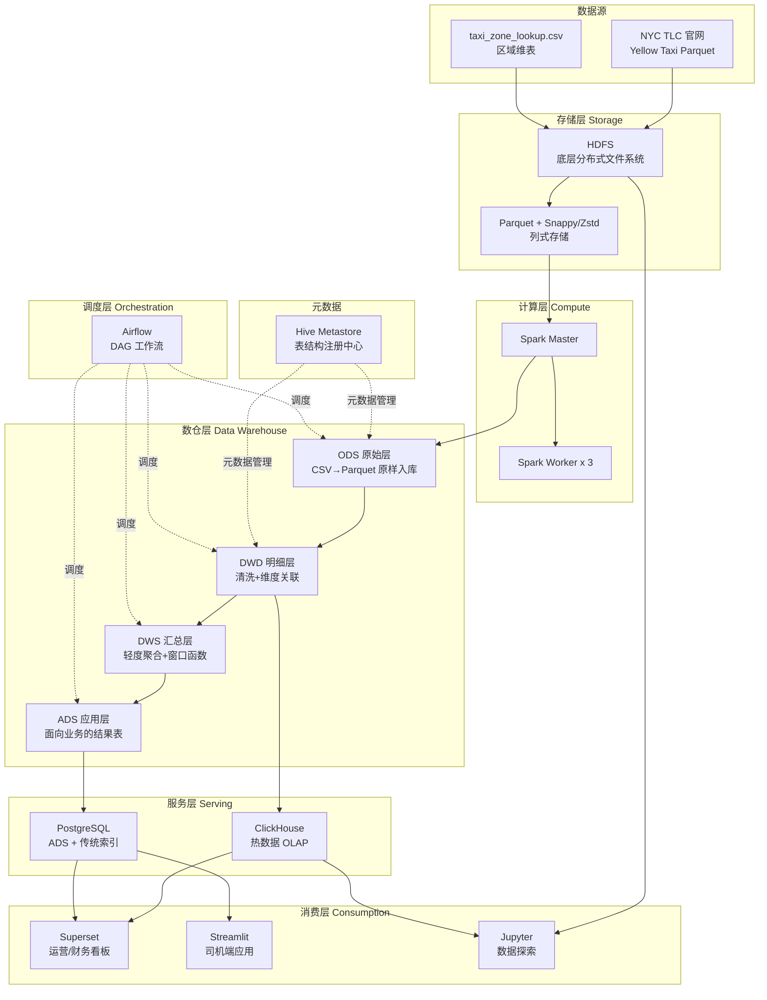
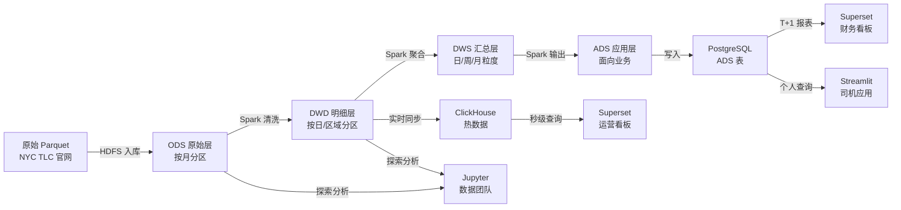

# PROJECT OVERVIEW — NYC 出租车智能运营平台

> **虚拟公司**:NYC Cab Co. | **数据规模**:3 年 / 约 3-5 亿条 / 50-80GB Parquet
> **技术栈深度**:存储 → 计算 → 数仓 → OLAP → 调度 → 可视化 全链路

---

## 一、业务背景

NYC Cab Co. 是一家运营纽约市出租车业务的中型公司，日均订单约 40 万条。过去数据散落在 Excel 和关系型数据库中，面临三大痛点：

| 痛点 | 具体表现 | 影响 |
|------|---------|------|
| 查询慢 | 财务月报跑 3 小时，早会前数据还没好 | 决策滞后 |
| 扩展难 | PostgreSQL 单表 5 亿行，加索引要停库 | 业务停摆风险 |
| 无实时 | 运营只能看昨天的数据，热点区域感知不到 | 收入损失 |

**解决方案**：构建一套分层数仓 + 冷热分离的企业级大数据平台。

---

## 二、三类业务用户需求

### 🚖 运营团队（热数据，秒级响应）
- 实时监控全市订单量、热点上车区域热力图
- 异常订单告警（行程 > 2 小时、单次计费 > $500）
- 供需缺口预测（哪个区域此刻打车难）
- **技术路径**：ClickHouse + Superset 实时看板

### 💰 财务团队（T+1 准确报表，数据可追溯）
- 日/周/月营收报表（精确到区域、时段、司机）
- 支付方式分布（现金/刷卡/网约）
- 不同区域、不同时段收益对比分析
- **技术路径**：PostgreSQL ADS 层 + Superset 报表看板

### 🧑‍✈️ 司机端（快速查询，个人视角）
- "当前时段，我附近 TOP 5 最赚钱的接单地点"
- "我本月收入与平台均值对比"
- 个人行程历史与收入趋势
- **技术路径**：PostgreSQL + Streamlit 轻量应用

### 🔬 数据团队（灵活探索，支持临时需求）
- Adhoc Query 支持（数据分析师的即席查询）
- 数据质量巡检（空值率、异常值告警）
- 新指标研发与验证
- **技术路径**：Spark SQL + Jupyter Notebook

---

## 三、完整架构图



---

## 四、数据流向图



---

## 五、技术栈全景

| 层级 | 组件 | 版本 | 核心作用 | 对应业务需求 |
|------|------|------|---------|------------|
| 存储 | HDFS | 3.3.x | 分布式文件系统，存原始+中间数据 | 所有团队数据底座 |
| 存储格式 | Parquet + Snappy/Zstd | — | 列式存储，压缩比高、查询快 | 节省存储成本 |
| 计算 | PySpark + Spark SQL | 3.4.x | 分布式 ETL，处理亿级数据 | 数据团队 Adhoc |
| 元数据 | Hive Metastore | 3.1.x | 管理表结构，Spark 直接 SQL 查询 | 统一数仓规范 |
| 热 OLAP | ClickHouse | 23.x | 列式存储，聚合查询秒级响应 | 运营团队实时监控 |
| 关系型 | PostgreSQL | 15.x | ADS 结果表，支持复杂索引优化 | 财务/司机端查询 |
| 调度 | Airflow | 2.7.x | DAG 工作流，每日 ETL 自动化 | 调度团队运维 |
| BI | Apache Superset | 3.x | 无代码看板，拖拽出图 | 运营/财务看板 |
| 应用 | Streamlit | 1.x | Python 快速构建 Web 应用 | 司机端工具 |
| 探索 | Jupyter | — | 数据探索、调试、原型验证 | 数据团队 |
| 容器化 | Docker Compose | — | 一键部署全栈，环境可复现 | 开发/生产一致性 |

---

## 六、阶段划分

| 阶段 | 主题 | 核心产出 | 预估时间 | 数据规模 |
|------|------|---------|---------|---------|
| STAGE 01 | 环境搭建与 HDFS 入门 | docker-compose 跑通，HDFS Web UI 可访问 | 3-4h | — |
| STAGE 02 | 数据接入与 ODS 层 | 原始数据入 HDFS，CSV vs Parquet 对比实验 | 4-5h | 2024 Q1（3个月）|
| STAGE 03 | 存储层优化 | 分区+分桶+压缩，小文件治理 | 4-5h | 2024 Q1 |
| STAGE 04 | DWD 层与数据清洗 | 清洗规则 + 维度关联，规范化明细表 | 4-5h | 2024 全年 |
| STAGE 05 | 计算层优化 | 谓词下推/广播 Join/AQE 对比实验 | 5-6h | 2024 全年 |
| STAGE 06 | 数据倾斜实战 | 模拟并解决倾斜，Task 时间分布对比 | 4-5h | 2024 全年 |
| STAGE 07 | DWS 层与查询优化 | 窗口函数/近似计算/物化视图 | 5-6h | 2022-2024 全量 |
| STAGE 08 | ADS 层 + PostgreSQL 索引 | 索引前后 EXPLAIN ANALYZE 对比 | 4-5h | 2022-2024 全量 |
| STAGE 09 | 冷热分层：ClickHouse 接入 | ClickHouse vs Spark SQL 响应时间对比 | 5-6h | 2022-2024 全量 |
| STAGE 10 | Airflow 调度编排 | 完整 ETL DAG，失败重试，邮件告警 | 4-5h | — |
| STAGE 11 | Superset 看板 | 运营/财务双看板，3 个以上图表 | 3-4h | — |
| STAGE 12 | Streamlit 司机应用 | 区域推荐 + 个人收入分析页面 | 3-4h | — |
| STAGE 13 | 项目复盘与简历输出 | README + 简历 bullet + 面试题清单 | 2-3h | — |

**合计预估**：50-65 小时（含调试时间，分散在 3-4 周内完成）

---

## 七、简历价值预览

做完本项目后，简历项目经历示例（**填入你实际跑出的数据**）：

```
【项目名称】NYC 出租车智能运营平台（企业级大数据全栈）

【技术栈】Spark 3.4 / HDFS / Hive / ClickHouse / PostgreSQL / Airflow / Superset / Docker

【项目描述】
• 独立搭建端到端大数据平台，处理 NYC Yellow Taxi 2022-2024 年数据，
  覆盖 __亿条记录、__GB 原始数据，完整实现 ODS→DWD→DWS→ADS 四层数仓架构

• 存储优化：将原始 CSV 转换为 Parquet + Zstd 格式，文件体积压缩 ___%，
  配合分区裁剪使 Spark 扫描数据量减少 ___倍，单次查询耗时从 ___s 降至 ___s

• 计算优化：通过广播 Join + AQE 自适应执行，将区域关联查询 Shuffle 数据量
  从 ___GB 降至 ___MB，任务运行时间提升 ___倍；解决司机 ID 数据倾斜问题，
  最长 Task 耗时从 ___s 降至 ___s

• 架构设计：实现冷热分层，ClickHouse 承接热查询，同比聚合查询响应时间
  从 Spark 的 ___s 降至 ___ms（提升约 ___倍）

• PostgreSQL 索引优化：对 ADS 层核心查询添加覆盖索引，
  EXPLAIN ANALYZE 显示扫描行数从 ___万行降至 ___行

• 通过 Airflow 构建 13 个 DAG 任务的自动化 ETL Pipeline，
  支持失败重试和邮件告警，日均调度稳定运行
```

---

## 八、面试题覆盖清单（做完能 hold 住）

做完这个项目，以下 20 道高频面试题你都能给出结合实战的答案：

### 存储与格式（4 题）
1. **为什么大数据场景要用 Parquet 而不是 CSV？** → 列式存储原理、谓词下推、压缩率
2. **Snappy vs Zstd vs Gzip，生产环境怎么选？** → 压缩比/解压速度/CPU 消耗三角权衡
3. **HDFS 小文件问题是什么？怎么解决？** → NameNode 内存压力、合并策略、HAR 归档
4. **分区和分桶的区别？什么场景用哪个？** → 分区裁剪 vs Join 消除 Shuffle

### 计算优化（5 题）
5. **谓词下推（Predicate Pushdown）是什么？Spark 怎么实现的？** → Catalyst 优化器
6. **Broadcast Join 和 Shuffle Hash Join 怎么选？** → 小表阈值、数据量、网络代价
7. **什么是 Spark AQE？它解决了什么问题？** → 运行时自适应、Skew Join、Partition 合并
8. **数据倾斜怎么发现、怎么处理？** → Stage 监控、加盐法、两阶段聚合
9. **CBO（基于代价的优化）和 RBO 的区别？** → 统计信息收集、Join Reorder

### 数仓设计（4 题）
10. **ODS/DWD/DWS/ADS 各层的职责是什么？为什么要分层？** → 数据血缘、复用性、稳定性
11. **什么是拉链表？什么场景用？** → SCD2、缓慢变化维
12. **维度建模 vs 范式建模，数仓里为什么选维度建模？** → 查询性能、可读性
13. **数据质量怎么做？空值/重复/异常值怎么处理？** → DWD 清洗规则、监控告警

### OLAP 与数据库（4 题）
14. **ClickHouse 为什么查询快？MergeTree 引擎原理是什么？** → 列式、稀疏索引、向量化执行
15. **ClickHouse 跳数索引（Skip Index）是什么？和 B-Tree 有什么区别？** → minmax/set/bloom_filter
16. **PostgreSQL 覆盖索引、复合索引、部分索引各自的适用场景？** → EXPLAIN ANALYZE 解读
17. **什么场景下 OLAP 比 OLTP 更适合？二者的本质区别？** → 读写模式、存储结构

### 架构与工程（3 题）
18. **Lambda 架构是什么？批流一体怎么理解？** → 批处理层/速度层/服务层
19. **Airflow 的 DAG 是什么？如何保证幂等性？** → 任务重跑、连接池、Sensor
20. **你们的数据平台如何保证数据血缘可追踪？** → 元数据管理、Hive Lineage

---

## 九、与市面上 "NYC Taxi 教程" 的本质区别

| 维度 | 市面教程 | 本项目 |
|------|---------|--------|
| 目标 | 跑通 Spark 代码，展示结果 | 理解每个决策的业务动因和工程代价 |
| 数据规模 | 通常用几个月，几 GB | 3 年 + 全量，50-80GB，真实体感 |
| 优化深度 | 大多只有基础使用 | 8 次量化对比实验，亲眼看见优化效果 |
| 架构完整性 | 单点技术演示 | 存储→计算→数仓→OLAP→调度→BI 全链路 |
| 业务视角 | 技术驱动 | 每个技术选型都对应具体业务需求 |
| 工程严谨性 | 能跑就行 | 分组启停、资源规划、错误处理、可复现 |
| 面试价值 | 能讲"用了什么" | 能讲"为什么选它、它解决了什么问题" |

**"企业级"的体现**：
- **资源管理**：分组启停，不会因为 OOM 前功尽弃
- **数据血缘**：四层数仓，每张表知道数据从哪来
- **可观测性**：Spark UI、Airflow 监控、ClickHouse system 表
- **可复现**：Docker Compose 一键还原，`.env` 统一配置

---

## 十、GitHub README 大纲（吸引面试官）

```markdown
# NYC 出租车智能运营平台

> 一个企业级大数据全栈项目，覆盖从 HDFS 存储到 BI 可视化的完整链路

## 📊 数据规模
- __亿条记录 | __GB 原始数据 | 2022-2024 三年 NYC Yellow Taxi

## 🏗️ 架构一览
[放架构图 Mermaid 渲染图]

## ⚡ 核心优化成果（量化）
| 优化项 | 优化前 | 优化后 | 提升倍数 |
|--------|-------|-------|---------|
| CSV→Parquet+Zstd | ___s | ___s | ___x |
| 全表扫描→分区裁剪 | ___GB | ___GB | ___x |
| Shuffle Join→Broadcast | ___s | ___s | ___x |
| Spark SQL→ClickHouse | ___s | ___ms | ___x |
| 无索引→覆盖索引 | ___行扫描 | ___行扫描 | ___x |

## 🛠️ 技术栈
[技术栈表格]

## 📂 项目结构
[目录树]

## 🚀 快速启动
[分两步：core 组 + serving 组]

## 📈 看板截图
[Superset 运营看板 + 财务看板截图]

## 🎯 对比实验记录
[链接到 benchmarks/ 目录，每次实验有数据]

## 💡 核心设计决策
1. 为什么选 ClickHouse 而非 Druid？
2. 为什么用分层数仓而非直接写 ADS？
3. 为什么 Airflow 而非 Cron？
```
