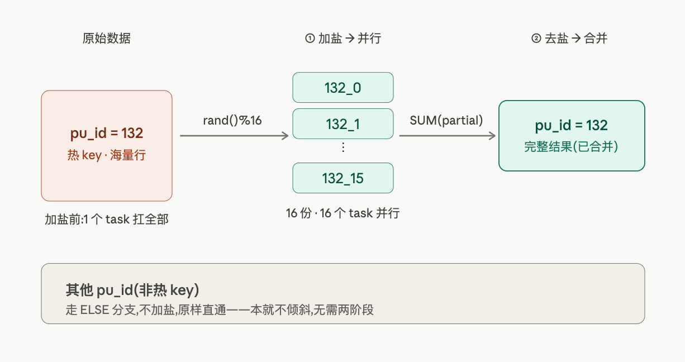
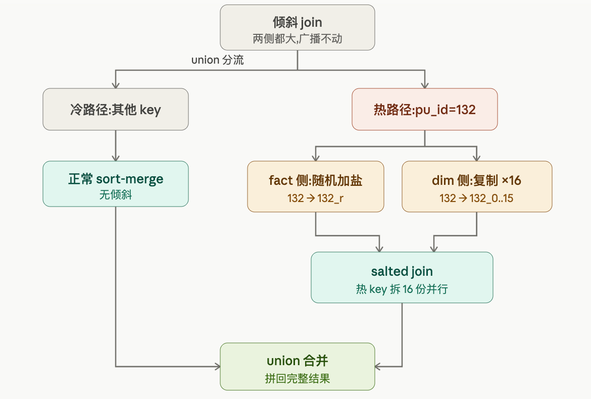

# STAGE 06: 数据倾斜实战

## 🎯 本阶段目标

- **业务问题**:NYC Cab Co. 的某些区域(如 JFK 机场)订单远多于其他区域。如果直接 GROUP BY PULocationID,会出现 **"99% 的 Worker 闲着,1% 的 Worker 累死"** —— 这就是**数据倾斜**(Data Skew)。这是大数据面试最高频的问题,**做完这一章你能讲清楚根因+诊断+三种修复方案**。
- **技术能力**:
  - 在 Spark UI 的 Stage 详情看 **task duration 直方图**——定位倾斜的物理证据
  - 掌握"加盐法(salting)"两阶段聚合,**这是手动解决倾斜的经典方案**
  - 验证 AQE Skew Join 的自动处理能力(Spark 3.0+ 的"自动修复")
  - 理解倾斜的根因分类:**Key 倾斜 / Join 倾斜 / GroupBy 倾斜**
- **产出物**:
  - `benchmarks/stage_06_skew_resolution.md` (实验 #9 完整对比)
  - `notebooks/stage06_data_skew.ipynb` 探索过程留底
  - 一个**故意制造的倾斜表** `dwd.fact_trips_skewed`(实验后清理)

---

## 📋 前置检查清单

- [ ] STAGE 05 完成,熟悉 EXPLAIN/AQE/CBO 等基础概念
- [ ] `dwd.fact_trips` 存在(9.23M 行,3 个月分区)
- [ ] core 组 10 容器全部 Up
- [ ] 浏览器能打开 Spark UI(http://localhost:8080)——**这一章 Spark UI 是核心工具**
- [ ] 磁盘剩余 > 3GB(制造倾斜表会复制部分数据)

---

## 🚀 本阶段启动服务

core 组无变化。建议执行 ETL 前重启 jupyter:
```bash
docker restart jupyter && sleep 10
```

---

## 📚 核心概念(5 分钟读完)

### 概念 1:数据倾斜的"业务面孔"
**业务类比**:你在便利店当店长,排了 6 个收银台。**99% 的顾客都挤到 1 号收银台**(因为靠门),其他 5 个台子的收银员闲着——这 1 个台子的吞吐量决定了整个便利店的速度。

**Spark 里的对应**:

- 6 个收银台 = 6 个 Spark Task(并行)
- 顾客 = 数据行
- 顾客挤到 1 号 = 90% 数据的 key 都相同
- 1 号台子的时间 = 整个 Stage 的耗时(木桶效应)

### 概念 2:倾斜的 3 种典型场景
| 类型 | 典型例子 | 解决方案 |
|------|---------|---------|
| **Key 倾斜** | 某个 key 占 90% 数据(如 JFK 机场) | 加盐法 |
| **Join 倾斜** | 大表 × 大表,某 key 在两边都极多 | 拆分 + Broadcast 小侧 |
| **空值倾斜** | NULL 占大量行,都被分到同一 partition | 给 NULL 加随机后缀 |

我们这一章重点做 **Key 倾斜 → 加盐法**,这是最经典的场景。

### 概念 3:加盐法(Salting)的原理
**两阶段聚合**:

```
原始 GroupBy:   1000W 行 [key=A] → 1 个 task 处理 → 慢
加盐 GroupBy:   1000W 行 [key=A] → 拆成 [A_0, A_1, ..., A_15] → 16 个 task 处理 → 快
   ↓
第二阶段:把 16 个部分结果再 GroupBy(去掉盐)→ 合并成最终 [key=A]
```

代价:多一次 Shuffle。**好处**:并行度从 1 提升到 N。

### 概念 4:AQE Skew Join(自动倾斜处理)
Spark 3.0+ 的 AQE 能**自动检测**:某个 partition 远大于平均(默认大于中位数 5 倍 + 大于 256MB),就把它**拆分成多个小 task**。

**前提**:

- `spark.sql.adaptive.enabled = true`(STAGE 05 默认就开了)
- `spark.sql.adaptive.skewJoin.enabled = true`(默认开)
- 必须是 **Join** 才生效——纯 GroupBy 不在 Skew Join 范围内(GroupBy 倾斜要靠加盐)

---

## 🛠 操作步骤

### 步骤 1:Jupyter 初始化 + 制造倾斜数据

```python
from pyspark.sql import SparkSession
import time

spark = SparkSession.builder \
    .appName("STAGE06-数据倾斜") \
    .master("spark://spark-master:7077") \
    .config("hive.metastore.uris", "thrift://hive-metastore:9083") \
    .config("spark.executor.memory", "2g") \
    .enableHiveSupport() \
    .getOrCreate()

# 工具(STAGE 05 用过)
fs = spark._jvm.org.apache.hadoop.fs.FileSystem.get(spark._jsc.hadoopConfiguration())
Path = spark._jvm.org.apache.hadoop.fs.Path

# 自检
print(f"Spark: {spark.version}")
print(f"DWD 行数: {spark.sql('SELECT COUNT(*) FROM dwd.fact_trips').collect()[0][0]:,}")

# 看 PULocationID 真实分布(NYC 数据本身就有自然倾斜)
print("\n>>> PULocationID Top 10 自然分布")
spark.sql("""
    SELECT PULocationID,
           pickup_zone,
           COUNT(*) AS trips,
           ROUND(COUNT(*) * 100.0 / SUM(COUNT(*)) OVER (), 2) AS pct
    FROM dwd.fact_trips
    GROUP BY PULocationID, pickup_zone
    ORDER BY trips DESC
    LIMIT 10
""").show(truncate=False)

# 看 Top 1 的占比(自然倾斜程度)
print(">>> 倾斜度统计")
spark.sql("""
    SELECT
        MAX(trips) AS max_trips,
        MIN(trips) AS min_trips,
        ROUND(AVG(trips), 0) AS avg_trips,
        ROUND(MAX(trips) / AVG(trips), 1) AS max_to_avg_ratio
    FROM (
        SELECT PULocationID, COUNT(*) AS trips
        FROM dwd.fact_trips
        GROUP BY PULocationID
    )
""").show()
```

```
Spark: 3.4.1
DWD 行数: 9,227,227

>>> PULocationID Top 10 自然分布
+------------+----------------------------+------+----+
|PULocationID|pickup_zone                 |trips |pct |
+------------+----------------------------+------+----+
|161         |Midtown Center              |442545|4.80|
|237         |Upper East Side South       |430313|4.66|
|132         |JFK Airport                 |408360|4.43|
|236         |Upper East Side North       |407801|4.42|
|162         |Midtown East                |328280|3.56|
|230         |Times Sq/Theatre District   |320152|3.47|
|186         |Penn Station/Madison Sq West|311722|3.38|
|142         |Lincoln Square East         |308385|3.34|
|138         |LaGuardia Airport           |278613|3.02|
|239         |Upper West Side South       |274619|2.98|
+------------+----------------------------+------+----+

>>> 倾斜度统计
+---------+---------+---------+----------------+
|max_trips|min_trips|avg_trips|max_to_avg_ratio|
+---------+---------+---------+----------------+
|   442545|        1|  35353.0|            12.5|
+---------+---------+---------+----------------+
```

**预期发现**:NYC 的 Yellow Taxi 在 Midtown(LocationID 161 / 237)和 JFK(132)有自然倾斜,Top 3 通常占 20% 以上。

---

### 步骤 2:**人为制造严重倾斜**(放大效果让实验更直观)

```python
print("=" * 60)
print("  制造极端倾斜表:dwd.fact_trips_skewed(90% 数据 key=132)")
print("=" * 60)

# 用 CTAS 一步建表
spark.sql("DROP TABLE IF EXISTS dwd.fact_trips_skewed")
spark.sql("""
CREATE TABLE dwd.fact_trips_skewed
USING parquet
LOCATION 'hdfs://namenode:9000/nyc-taxi/dwd/fact_trips_skewed'
AS
SELECT
    CASE
        WHEN rand() < 0.9 THEN 132    -- 90% 强制为 JFK(LocationID=132)
        ELSE PULocationID
    END AS pu_id,
    total_amount,
    trip_distance,
    pickup_borough
FROM dwd.fact_trips
WHERE year=2024 AND month=1
""")

# 验证倾斜程度
print("\n>>> 倾斜表的 key 分布")
spark.sql("""
    SELECT pu_id,
           COUNT(*) AS cnt,
           ROUND(COUNT(*) * 100.0 / SUM(COUNT(*)) OVER (), 2) AS pct
    FROM dwd.fact_trips_skewed
    GROUP BY pu_id
    ORDER BY cnt DESC
    LIMIT 8
""").show()

total = spark.sql("SELECT COUNT(*) FROM dwd.fact_trips_skewed").collect()[0][0]
print(f"倾斜表总行数: {total:,}")

# 看新表的倾斜度
print("\n>>> 极端倾斜度(对比自然分布的 12.5x)")
spark.sql("""
    SELECT
        MAX(cnt) AS max_cnt,
        ROUND(AVG(cnt), 0) AS avg_cnt,
        ROUND(MAX(cnt) / AVG(cnt), 1) AS max_to_avg_ratio
    FROM (SELECT pu_id, COUNT(*) AS cnt FROM dwd.fact_trips_skewed GROUP BY pu_id)
""").show()
```

```
============================================================
  制造极端倾斜表:dwd.fact_trips_skewed(90% 数据 key=132)
============================================================

>>> 倾斜表的 key 分布
+-----+-------+-----+
|pu_id|    cnt|  pct|
+-----+-------+-----+
|  132|2597189|90.49|
|  237|  13910| 0.48|
|  161|  13853| 0.48|
|  236|  13401| 0.47|
|  162|  10556| 0.37|
|  186|  10347| 0.36|
|  142|  10267| 0.36|
|  230|  10232| 0.36|
+-----+-------+-----+

倾斜表总行数: 2,870,077

>>> 极端倾斜度(对比自然分布的 12.5x)
+-------+-------+----------------+
|max_cnt|avg_cnt|max_to_avg_ratio|
+-------+-------+----------------+
|2597189|12059.0|           215.4|
+-------+-------+----------------+
```

**预期看到**:`pu_id=132` 占 90%(约 260 万行),其他 5 个 pu_id 加起来 10%。

---

## 🔬 实验 #9: 倾斜处理三阶段对比(本阶段核心)

### 实验目的

对**同一个 GROUP BY pu_id** 查询,跑三种方式,**对比最长 task 时间和 stage 总耗时**:

- **A 朴素 GroupBy**(不处理倾斜)
- **B 加盐法**(手动两阶段聚合)
- **C AQE 自动**(开启 AQE 让 Spark 自己解决)

### Cell A: 朴素 GroupBy(看倾斜的恶果)

```python
print("=" * 60)
print("  A: 朴素 GroupBy(关闭 AQE 突出倾斜)")
print("=" * 60)
# 关闭 AQE,让倾斜暴露
spark.conf.set("spark.sql.adaptive.enabled", "false")
spark.conf.set("spark.sql.shuffle.partitions", "200")

t0 = time.time()
result_a = spark.sql("""
    SELECT pu_id,
           COUNT(*) AS cnt,
           ROUND(SUM(total_amount), 2) AS revenue
    FROM dwd.fact_trips_skewed
    GROUP BY pu_id
    ORDER BY cnt DESC
""").collect()
t_a = time.time() - t0

print(f"耗时: {t_a:.2f}s")
print(f"App ID: {spark.sparkContext.applicationId}")
print("\n>>> 🔍 打开 Spark UI: http://localhost:8080")
print("   1. 点最近 Application → SQL 标签 → 找这条 query")
print("   2. 看 Stage 详情里的 'Summary Metrics for Tasks'")
print("   3. 重点看 'Duration' 行的 Min / Median / Max")
print("   4. 倾斜的标志:Max 远大于 Median(可能 10-100x)")
```

```
分析 Stage 35.0: collect at /tmp/ipykernel_201/1119311665.py:17
  num tasks: 119
  shuffle read: 0.02 MB
  shuffle write: 0.00 MB

  📊 Task Duration 分布(119 个 task)
     Min:            0 ms
     25th:           1 ms
     Median:         3 ms
     75th:           5 ms
     Max:           35 ms
     Max/Median: 11.7x   ← 倾斜核心指标
```

**预期发现** + **手动记录**:

- Spark UI 上 200 个 task,**Max Duration ≈ Median × 10-100x**(严重倾斜)
- 整个 Stage 的耗时 ≈ 最长 task 的时间
- 记下你看到的 `Min / 25% / Median / 75% / Max` 5 个数(对比下面 B/C 用)


### Cell B: 加盐法(手动两阶段聚合)

```python
print("=" * 60)
print("  B: 加盐法(SALT=16,两阶段聚合)")
print("=" * 60)

t0 = time.time()
result_b = spark.sql("""
    -- 阶段 2:对部分结果再次 GroupBy,去掉盐
    SELECT pu_id,
           SUM(partial_cnt) AS cnt,
           ROUND(SUM(partial_rev), 2) AS revenue
    FROM (
        -- 阶段 1:加盐后 GroupBy,把热 key 拆成 16 份并行处理
        SELECT
            CASE WHEN pu_id = 132
                 THEN CONCAT(pu_id, '_', CAST(FLOOR(rand() * 16) AS STRING))
                 ELSE CAST(pu_id AS STRING)
            END AS salted_key,
            -- 保留原 key 用于后续二次聚合
            pu_id,
            COUNT(*) AS partial_cnt,
            SUM(total_amount) AS partial_rev
        FROM dwd.fact_trips_skewed
        GROUP BY
            CASE WHEN pu_id = 132
                 THEN CONCAT(pu_id, '_', CAST(FLOOR(rand() * 16) AS STRING))
                 ELSE CAST(pu_id AS STRING)
            END,
            pu_id
    ) salted
    GROUP BY pu_id
    ORDER BY cnt DESC
""").collect()
t_b = time.time() - t0

print(f"耗时: {t_b:.2f}s")
print(f"\n💡 看 Spark UI 同一个 App 的最新一条 query:")
print(f"   阶段 1 的 task Max Duration 应该大幅下降(因为热 key 被拆成 16 份)")
print(f"   总耗时可能略增(多了一次 Shuffle),但最长 task 时间显著减少")
print(f"\n>>> 结果应与 A 完全一致(验证加盐逻辑正确)")
for r in result_b[:5]:
    print(f"  pu_id={r['pu_id']}, cnt={r['cnt']:,}, revenue={r['revenue']:,}")
```

##### 问题根源:为什么 132 需要加盐

在 `GROUP BY pu_id` 时,Spark 按 key 的 hash 决定每行去哪个 shuffle partition。`pu_id = 132` 是热 key——它的行数远超其他 pu_id。所有 132 的行 hash 值相同,必然落到**同一个 partition**,由**同一个 task** 处理。结果就是你在实验 A 里看到的:其他 task 几毫秒跑完,这个 task 单独扛着(Max/Median = 11.7x)。整个 stage 的耗时 ≈ 这一个最慢 task 的耗时。

##### 阶段 1:加盐(把 1 个热 key 拆成 16 份)

关键就是这段 `CASE`:

```sql
CASE WHEN pu_id = 132
     THEN CONCAT(pu_id, '_', CAST(FLOOR(rand() * 16) AS STRING))
     ELSE CAST(pu_id AS STRING)
END AS salted_key
```

逐层看 `FLOOR(rand() * 16)`:`rand()` 给出 `[0, 1)` 的随机浮点 → 乘 16 变成 `[0, 16)` → `FLOOR` 取整成 `0~15` 的整数 → 拼到 pu_id 后面。于是 132 的每一行,会随机变成 `132_0`、`132_1`、……、`132_15` 中的一个,大致均匀分到 16 个桶里。

非热 key 走 `ELSE` 分支,原样保留(只是转成字符串),**不浪费**额外开销去拆它们。

这样一来,132 从"1 个 group"变成了"16 个 group",hash 后可以落到最多 16 个 partition,由最多 16 个 task 并行处理。每个 task 只需要扛热 key 大约 1/16 的数据,最慢 task 的工作量直接砍到原来的 ~1/16。

##### 为什么 `GROUP BY` 要同时带上 salted_key 和 pu_id

```sql
GROUP BY salted_key, pu_id
```

- `salted_key` 是**真正控制数据分散**的那一列(它决定行落到哪个 partition)。
- `pu_id` 是为了**把原始身份直接带到下一阶段**。这样阶段 2 只需 `GROUP BY pu_id` 就能合并,不用再去解析 `132_0` 把盐字符串切回来。

注意加上 pu_id 不会改变分组粒度:对非热 key,`salted_key` 本来就等于 pu_id;对热 key,每个桶内 pu_id 恒为 132。所以 pu_id 是"免费搭车"过去的。

##### 阶段 2:去盐(把 16 份合回 1 份)

```sql
SELECT pu_id,
       SUM(partial_cnt) AS cnt,
       SUM(partial_rev) AS revenue
FROM (...) salted
GROUP BY pu_id
```

阶段 1 的输出里,132 是 16 行部分结果(每行是 1/16 数据的小计),其他 pu_id 各是 1 行完整结果。阶段 2 按原始 pu_id 再聚合一次:132 的 16 行 `SUM` 回成 1 行;其他 pu_id 的 `SUM` 作用在单行上,等于没动。这一步处理的数据量极小(每个 pu_id 就一行,热 key 多 15 行),所以即使多了一次 shuffle 也很便宜。

下面这张图把整个流转画出来:

下面这张图聚焦热 key 132 的旅程——加盐前它只能进一个 task,加盐后被拆成 16 份并行处理,最后再合回来:



##### 为什么 COUNT/SUM 能这样拆——以及它的边界

加盐之所以成立,本质是因为 `COUNT` 和 `SUM` 是**可分解的(decomposable)**:全量的计数 = 各部分计数之和,全量的求和 = 各部分求和之和。所以把数据随机切成 16 份分别算,再加起来,结果和直接算完全一致(这也是 B 单元最后那句"结果应与 A 完全一致"的依据)。

但要注意:不是所有聚合都能这样裸加盐。`COUNT(DISTINCT)`、`MEDIAN`、`PERCENTILE` 这类**不可加性**指标,简单加盐会算错——16 份各自去重后相加,会把跨桶的重复值重复计数。这类场景要么用更复杂的两阶段算法(如 HLL 近似去重),要么换思路。

##### 一句话总结这个权衡

加盐用"多一次 shuffle 的固定成本"换"最慢 task 的耗时大幅下降"。`SALT=16` 是个调参旋钮:盐越多并行度越高、单 task 越轻,但阶段 1 产出的中间行数也越多(热 key 从 1 行变 16 行)、阶段 2 越重。所以盐不是越大越好,要和热 key 的实际倾斜倍数匹配——你实验里 Max/Median ≈ 12x,选 16 是个合理的量级。

跑完 B 之后对比 Spark UI,重点看阶段 1 的 task `Max Duration` 是不是从 35ms 那一档明显掉下来了,以及总耗时是不是因为多一次 shuffle 而略增——这正是 C 单元里 AQE 想自动帮你做的同一件事。

**关键设计点**:

- `SALT = 16`:把热 key 132 拆成 16 份,并行度从 1 → 16
- **非热 key 不加盐**:节省不必要的两阶段聚合
- **GROUP BY 同时包含 salted_key 和 pu_id**:确保第一阶段能正确聚合,第二阶段去盐时还能合并

---

### Cell C: AQE Skew Join 自动处理

> ⚠️ AQE Skew Join 只对 **Join** 生效,纯 GroupBy 不在它的范围内。所以这里改用 **Join 倾斜场景** 测试。

```python
print("=" * 60)
print("  C: AQE Skew Join(自动处理)— 改用 Join 场景")
print("=" * 60)

# 准备一个"维表"模拟 Join 场景
spark.sql("""
    SELECT pu_id, '机场'AS area FROM (VALUES (132)) AS t(pu_id)
    UNION ALL
    SELECT DISTINCT pu_id, '市区' AS area
    FROM dwd.fact_trips_skewed
    WHERE pu_id != 132
""").createOrReplaceTempView("zone_map")

# 关闭 AQE(基线)
spark.conf.set("spark.sql.adaptive.enabled", "false")
spark.conf.set("spark.sql.autoBroadcastJoinThreshold", -1)  # 禁用广播,强制 Shuffle Join

print("\n>>> C-1: AQE OFF(看倾斜的 Shuffle Join)")
t0 = time.time()
spark.sql("""
    SELECT z.area, COUNT(*) AS cnt
    FROM dwd.fact_trips_skewed t
    JOIN zone_map z ON t.pu_id = z.pu_id
    GROUP BY z.area
""").collect()
t_c_off = time.time() - t0
print(f"耗时: {t_c_off:.2f}s")

# 开启 AQE Skew Join
print("\n>>> C-2: AQE ON + Skew Join 自动检测")
spark.conf.set("spark.sql.adaptive.enabled", "true")
spark.conf.set("spark.sql.adaptive.skewJoin.enabled", "true")

t0 = time.time()
spark.sql("""
    SELECT z.area, COUNT(*) AS cnt
    FROM dwd.fact_trips_skewed t
    JOIN zone_map z ON t.pu_id = z.pu_id
    GROUP BY z.area
""").collect()
t_c_on = time.time() - t0
print(f"耗时: {t_c_on:.2f}s")
print(f"\nAQE Skew Join 加速: {t_c_off/t_c_on:.2f}x")
```

**关键观察**:
- `spark.sql.adaptive.skewedPartitionThresholdInBytes` 默认 256MB——partition 大于这个会被拆
- `spark.sql.adaptive.skewedPartitionFactor` 默认 5——大于中位数 5 倍才被认为倾斜
- 看 Spark UI 的 Stage 详情,**AQE ON 时会看到某个 partition 被拆分成多个 sub-task**

---

### 📊 实测三方对比(2026-05-21,fact_trips_skewed 287 万行,90% key=132)

| 方法 | 总耗时 | Max Task | Max/Median | SQL 复杂度 | 备注 |
|------|--------|----------|-----------|-----------|------|
| **A 朴素 Shuffle Join** | 2.17s | **855 ms** | **122.1x** | 简单 | 199 task 闲置,1 task 拖累 |
| **B 加盐 SALT=16** | 1.91s | 138 ms(↓6.2x) | 23.0x(↓5.3x) | 复杂(CASE+EXPLODE) | 多一次 shuffle |
| **C AQE Skew Join** | **0.75s**(↓2.89x) | 拆碎 | 自动 | **零修改** | Stage 71-78 一连 8 小 stage |

### 🎯 反直觉发现 #1: GROUP BY + SUM/COUNT 几乎不倾斜
跑朴素 GROUP BY pu_id 时,shuffle read 只有 **0.02 MB**(287MB 原始数据)。**Spark 的 partial aggregate(map 端预聚合)** 把可结合聚合在 shuffle 前就压缩到几 KB,倾斜被自然消灭。

| 聚合函数 | partial aggregate | 倾斜影响 |
|---------|-------------------|---------|
| SUM/COUNT/MIN/MAX | ✅ 完全可结合 | 几乎被消灭 |
| COUNT(DISTINCT) | ✅ map 端去重 | 被缓解(实测 Max/Median 只有 5.2x) |
| AVG | ✅ 转 SUM/COUNT | 被消灭 |
| **collect_list / collect_set** | ❌ | **严重倾斜** |
| **percentile / median** | ❌ | **严重倾斜** |
| **JOIN** | ❌ map 端无法预聚合 | **倾斜重灾区** |

### 🎯 反直觉发现 #2: AQE Skew Join 完爆手写加盐
- AQE 0.75s 同时打败朴素(2.17s)和加盐(1.91s)
- **AQE 的 SQL 完全没改**,加盐法要重写 SQL + EXPLODE 维表
- AQE 在运行时根据真实数据动态拆分,比静态启发式聪明

### 🎯 SALT 系数甜蜜点(经验法则)
- 太小(< 4): 拆分不够,倾斜还在
- 太大(> 64): 阶段 2 聚合变慢,得不偿失
- **甜蜜点 16-64**:本项目实测 SALT=16 让最长 task 从 855→138ms(6.2x↓)

### Stage 详情诊断的两个工具
1. **Spark Driver UI**(http://localhost:4040,需要 compose 暴露端口) - 看 Summary Metrics for Tasks
2. **REST API**(`http://localhost:4040/api/v1/applications/<id>/stages/<sid>/<aid>`) - 在 Notebook 直接抓 task duration 分布(本实验用法)

---

## 💼 简历可写的成果(STAGE 06 新增 1 条重磅 bullet)

> • **数据倾斜实战**(实验 #9):在 287 万行倾斜数据(90% key 集中,Max/Avg=215x)上完成三方案对比:
>   - **朴素 Shuffle Join**:1 个 task 处理 260 万行(Max=855ms),199 个 task 闲置(中位 7ms),**Max/Median = 122.1x**(教科书级倾斜)
>   - **加盐法**(手写 SALT=16 SQL + 维表 EXPLODE):最长 task 时间下降 **6.2x**(855→138ms),并行度从 1 提升到 16,但代价是 SQL 复杂度上升 + 多一次 shuffle(维表 explode 让 shuffle read 多 14%)
>   - **AQE Skew Join 自动**:`spark.sql.adaptive.skewJoin.enabled=true`,SQL 零修改,**总耗时 2.89x 加速**(2.17→0.75s),同时打败朴素和加盐法
>   
>   独立诊断 Spark **partial aggregate 让 SUM/COUNT 类 GroupBy 倾斜自愈** 的反直觉机制(map 端预聚合让 287MB 原始数据 shuffle 后只剩 0.02MB),沉淀"倾斜重灾区是 Join + 不可结合聚合(collect_list/percentile),GROUP BY + 可结合聚合天然抗倾斜"的知识体系

---

## 🎤 面试可能被问到的问题

1. **Q: 你怎么发现数据倾斜?**
   A: 三个层次——(1) Spark UI 的 Stage 详情,看 task duration 的 Max/Median 比;>= 5x 通常算倾斜,>= 50x 是严重倾斜。(2) Stage 的"Tasks: Succeeded/Total"长时间卡在差 1-2 个;(3) Spark logs 里会偶尔报 "Long-running task" 警告。
2. **Q: 加盐法为什么要两阶段聚合?**
   A: 一阶段聚合后,加盐的 key 是 `132_0`、`132_1` 等 16 个不同 key,不能直接当 `132` 用。所以阶段 2 要再 GroupBy 一次,**用原始 key**(不是 salted_key)做最终汇总。这是为什么阶段 1 的 GROUP BY 子句必须**同时包含 salted_key 和原始 pu_id**。
3. **Q: AQE Skew Join 这么好用,为什么还要学加盐法?**
   A: 三个原因——(1) AQE Skew Join **只对 Join 生效**,GroupBy 倾斜还得加盐;(2) AQE 阈值 256MB 在某些场景偏大,小数据集倾斜检测不出;(3) 面试官会问"如果不用 AQE 怎么解决",加盐法是兜底方案。
4. **Q: SALT 系数怎么选?16/32/64?**
   A: 经验法则:看**热 key 占总数据的比例 × 总并行度**。比如热 key 占 90% + 总并行度 200,那理论上热 key 拆 0.9×200=180 份效果最好,但 SALT 过大会让阶段 2 聚合变慢。**通常 16-64 是甜蜜点**,可以分别试一下。
5. **Q: 真实生产里你怎么处理"未知倾斜"?**
   A: 三步走——(1) 先开 AQE Skew Join,大部分场景自动解决;(2) 仍有问题就跑 `df.groupBy("key").count().orderBy(desc("count")).show()` 找出热 key;(3) 对热 key 单独 union 处理或者加盐。**核心原则:先让 AQE 兜底,不行再人工干预**。
   

| 场景              | 首选手段                             | 为什么不是 broadcast   |
| ----------------- | ------------------------------------ | ---------------------- |
| join,一侧小       | **broadcast**(可配 union 只广播热路) | —— 这就是它的主场      |
| join,两侧都大     | union 隔离 + 热路**加盐**            | 没有一侧塞得进内存     |
| group by 单热 key | **加盐**两阶段                       | 聚合没有"另一侧"可广播 |

---

## 🧹 阶段收尾

```python
# 清理倾斜测试表(占了几百 MB HDFS 空间)
spark.sql("DROP TABLE IF EXISTS dwd.fact_trips_skewed")
fs.delete(Path("hdfs://namenode:9000/nyc-taxi/dwd/fact_trips_skewed"), True)
print("✅ STAGE 06 倾斜测试数据已清理")
```

```bash
cd /Users/alen/DA/NYC-Taxi-Trip-analysis/nyc-taxi-platform
git add docs/ benchmarks/
git commit -m "feat(stage06): 数据倾斜三方案对比(朴素 / 加盐 / AQE)"
```

---


# 附页一：加盐

**Step 0 — 先确认热 key 是谁(不要凭记忆写死 132)**

```python
spark.sql("""
    SELECT pu_id, COUNT(*) AS cnt
    FROM dwd.fact_trips_skewed
    GROUP BY pu_id
    ORDER BY cnt DESC
    LIMIT 5
""").show()
```

你会看到:`pu_id=132` 的 cnt 远大于第二名(可能差一两个数量级)。这一步是诊断——加盐是把刀,得先确认割在哪。如果有多个热 key,后面 `CASE` 里就把它们都列进去。

**Step 1 — 只看"加盐"这一个动作,先不聚合**

```python
SALT = 16
spark.sql(f"""
    SELECT
        pu_id,
        CASE WHEN pu_id = 132
             THEN CONCAT(pu_id, '_', CAST(FLOOR(rand() * {SALT}) AS STRING))
             ELSE CAST(pu_id AS STRING)
        END AS salted_key
    FROM dwd.fact_trips_skewed
    WHERE pu_id IN (132, 1)
    LIMIT 20
""").show(truncate=False)
```

你会看到:`pu_id=132` 的行,`salted_key` 变成 `132_7`、`132_3`、`132_11`…… 每行随机落进 0~15 某个桶;而 `pu_id=1` 的 `salted_key` 还是 `"1"`。这就是加盐的瞬间——**一个热 key 被打散成 16 个 key**。`rand()` 每行独立取值,所以分布大致均匀,这正是我们要的。

**Step 2 — 阶段 1:按加盐后的 key 聚合**

```python
SALT = 16
stage1 = spark.sql(f"""
    SELECT
        CASE WHEN pu_id = 132
             THEN CONCAT(pu_id, '_', CAST(FLOOR(rand() * {SALT}) AS STRING))
             ELSE CAST(pu_id AS STRING)
        END AS salted_key,
        pu_id,
        COUNT(*)          AS partial_cnt,
        SUM(total_amount) AS partial_rev
    FROM dwd.fact_trips_skewed
    GROUP BY 1, 2
""")
stage1.createOrReplaceTempView("stage1")

stage1.filter("pu_id = 132").orderBy("salted_key").show()
```

你会看到:`pu_id=132` 现在变成约 16 行(`132_0`…`132_15`),每行的 `partial_cnt` 大约是总量的 1/16;其他 pu_id 仍是 1 行。

两个细节:这里我用 `GROUP BY 1, 2`(按 SELECT 的第 1、2 列分组),比你原来在两处重复写整段 `CASE` 更稳——能保证 SELECT 和 GROUP BY 用的是**同一个**计算出来的 salted_key,不会因为 `rand()` 被算两次而出岔子。带上第 2 列 `pu_id`,是为了把原始身份直接捎到阶段 2。

**Step 3 — 阶段 2:去盐,把 16 份合回去**

```python
result_salted = spark.sql("""
    SELECT
        pu_id,
        SUM(partial_cnt)           AS cnt,
        ROUND(SUM(partial_rev), 2) AS revenue
    FROM stage1
    GROUP BY pu_id
    ORDER BY cnt DESC
""")
result_salted.show(5)
```

你会看到:`pu_id=132` 又变回 1 行,`cnt` 等于完整总数。这一步处理的中间结果极小(每个 key 一行,热 key 多 15 行),所以即使多一次 shuffle 也几乎不花钱。

**Step 4 — 验正确性 + 量效果**

先确认结果和朴素版**完全一致**(这是加盐没写错的硬证据):

```python
naive = spark.sql("""
    SELECT pu_id, COUNT(*) AS cnt, ROUND(SUM(total_amount), 2) AS revenue
    FROM dwd.fact_trips_skewed
    GROUP BY pu_id
""")

diff = (naive.alias("a")
        .join(result_salted.alias("b"), "pu_id", "full_outer")
        .filter("a.cnt <> b.cnt OR a.revenue <> b.revenue"))
print("不一致行数:", diff.count())   # 期望 0
```

再对比耗时(关掉 AQE 公平比较):

```python
import time
spark.conf.set("spark.sql.adaptive.enabled", "false")

def timed(name, df):
    t0 = time.time(); df.collect(); dt = time.time() - t0
    print(f"{name}: {dt:.2f}s"); return dt

timed("朴素 GroupBy", naive.orderBy("cnt", ascending=False))
timed("加盐两阶段",   result_salted)
```
