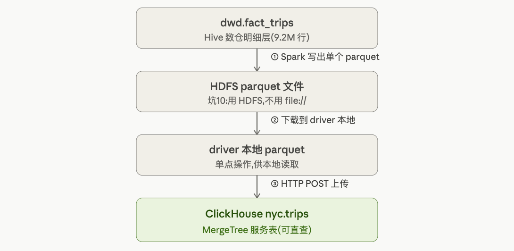

# STAGE 09: 冷热分层 — ClickHouse 接入

## 🎯 本阶段目标

- **业务问题**:运营团队要**实时监控大盘**(全市订单量、热点区域、异常告警),这些查询是**高频聚合**(GROUP BY 区域/时段 SUM/COUNT)。Spark SQL 每次启动 Job 几百毫秒,扛不住运营看板的秒级刷新。**ClickHouse 这种列式 OLAP 数据库,聚合查询能做到 10-100ms**——这一阶段把热数据放进 ClickHouse,实现冷热分层。
- **技术能力**:
  - 理解 ClickHouse MergeTree 引擎(稀疏索引 + 向量化执行)为什么聚合快
  - 用分组启停策略腾内存(Spark Worker 4G→3G,给 ClickHouse 让 4G)
  - DWD 数据导入 ClickHouse
  - **ClickHouse vs Spark SQL** 同查询性能对比(实验 #13)
  - 跳数索引(Skip Index): minmax / set / bloom_filter
  - 冷热分层架构: ClickHouse 热 + Parquet 温 + 对象存储冷
- **产出物**:
  - ClickHouse 表 `nyc.trips`(MergeTree 引擎)
  - `benchmarks/stage_09_clickhouse_vs_spark.md` (实验 #13)
  - `sql/clickhouse/trips_ddl.sql`

---

## 📋 前置检查清单

- [ ] STAGE 08 完成,`dwd.fact_trips` 存在(9.23M 行)
- [ ] core 组运行中
- [ ] **磁盘剩余 > 5GB**(ClickHouse 镜像 ~1GB + 数据)
- [ ] 内存:确认 Docker 有足够余量(core ~15G + ClickHouse 4G = 19G,在 24G 内)

---

## 🚀 本阶段启动服务(关键:内存腾挪 + ClickHouse 启动)

### Step A:Spark Worker 降配(4G → 3G,腾 3GB)

> RESOURCE_PLAN 规划的关键操作:STAGE 09+ 同时跑 ClickHouse 时,Spark Worker 从 4G 降到 3G。

修改 `docker/.env`:
```bash
# 把这一行
SPARK_WORKER_MEMORY=4g
# 改成
SPARK_WORKER_MEMORY=3g
```

重建 3 个 Worker(只重建 worker,不动其他):
```bash
cd /Users/alen/DA/NYC-Taxi-Trip-analysis/nyc-taxi-platform
docker compose -f docker/docker-compose.core.yml up -d --no-deps --force-recreate \
    spark-worker-1 spark-worker-2 spark-worker-3
```

### Step B:给 ClickHouse 挂载 data 目录(改 serving compose)

ClickHouse 需要能读到 Spark 导出的 Parquet。修改 `docker/docker-compose.serving.yml` 的 clickhouse 服务,确保 volumes 里有:
```yaml
    volumes:
      - clickhouse-data:/var/lib/clickhouse
      - ../data:/data            # 新增:挂载 data 目录读 Parquet
      - ./clickhouse/config.xml:/etc/clickhouse-server/config.d/custom.xml
      - ./clickhouse/users.xml:/etc/clickhouse-server/users.d/custom.xml
```

### Step C:启动 ClickHouse

```bash
docker compose -f docker/docker-compose.serving.yml up -d clickhouse

# 等 20 秒,验证
sleep 20
docker exec clickhouse clickhouse-client --query "SELECT version()"
```

**预期**:输出 ClickHouse 版本号(如 23.8.x),没报错。

---

## 📚 核心概念(5 分钟读完)

### 概念 1:ClickHouse 为什么聚合快?(3 个根本原因)
| 机制 | 说明 | 对比 |
|------|------|------|
| **列式存储** | 聚合只读需要的列 | 和 Parquet 同理,但 CH 针对查询优化更狠 |
| **稀疏主键索引** | 每 8192 行存一个主键标记(不是每行) | B-Tree 是每行,稀疏索引内存占用极小 |
| **向量化执行** | 一次处理一批(SIMD),不是一行一行 | Spark 也有,但 CH 是 C++ 原生更快 |

**业务类比**:Spark 像"通用工程队"(啥都能干,但每次开工要搭脚手架);ClickHouse 像"聚合专用机床"(只做聚合,但快到飞起)。

### 概念 2:MergeTree 引擎
ClickHouse 最重要的表引擎。核心特性:
- **ORDER BY**(排序键):数据按这个物理排序,**决定查询性能**(类似聚簇索引)
- **PARTITION BY**(分区键):粗粒度数据切分(通常按月)
- **后台 Merge**:小数据块自动合并成大块(名字由来)

### 概念 3:稀疏索引 vs B-Tree(和 STAGE 08 呼应)
| | PostgreSQL B-Tree | ClickHouse 稀疏索引 |
|--|-------------------|---------------------|
| 粒度 | 每行一个索引项 | 每 8192 行一个标记 |
| 空间 | 大(可能和数据一样大) | 极小(几 KB) |
| 适合 | 点查(找 1 行) | 范围扫描 + 聚合(找一片) |

**这就是为什么 PG 适合司机端点查(STAGE 08),CH 适合运营聚合(STAGE 09)**——架构层冷热分离的技术依据。

### 概念 4:跳数索引(Skip Index / Data Skipping Index)
ClickHouse 的"二级索引",不像 B-Tree 定位行,而是**记录数据块的统计信息,跳过不需要扫描的块**:
| 类型 | 记录什么 | 适合 |
|------|---------|------|
| `minmax` | 每个块的 min/max | 范围查询(和 Parquet row group 同理) |
| `set(N)` | 每个块的去重值集合(最多 N 个) | 低基数列等值查询 |
| `bloom_filter` | 布隆过滤器 | 高基数列等值查询(如 user_id) |

### 概念 5:冷热分层架构
```
热数据(最近 1-3 个月,高频查询)→ ClickHouse(内存+SSD,毫秒级)
温数据(1-2 年,偶尔查)        → HDFS Parquet(Spark 查,秒级)
冷数据(2 年+,归档)           → 对象存储 S3/OSS(极少查,分钟级)
```
**成本递减,延迟递增**。本项目热数据放 ClickHouse,温数据就是我们的 HDFS Parquet。

---

## 🛠 操作步骤

### 步骤 1-4:Spark 导出 → 下载 → 建表 → 导入(实际跑通的完整方案)

> ⚠️ 这一步踩了 3 个坑(见文末踩坑实录),最终方案:**Spark 写 HDFS → 下载到本地 → HTTP POST 上传 CH**。

```python
from pyspark.sql import SparkSession
import time, os, urllib.request, urllib.error, urllib.parse

spark = SparkSession.builder \
    .appName("STAGE09-ClickHouse") \
    .master("spark://spark-master:7077") \
    .config("hive.metastore.uris", "thrift://hive-metastore:9083") \
    .config("spark.executor.memory", "1500m") \
    .enableHiveSupport() \
    .getOrCreate()

def ch_query(sql):
    req = urllib.request.Request("http://clickhouse:8123/", data=sql.encode('utf-8'))
    try:
        return urllib.request.urlopen(req).read().decode('utf-8')
    except urllib.error.HTTPError as e:
        raise RuntimeError("CH ERROR: " + e.read().decode('utf-8'))

fs = spark._jvm.org.apache.hadoop.fs.FileSystem.get(spark._jsc.hadoopConfiguration())
Path = spark._jvm.org.apache.hadoop.fs.Path

# 步骤 1: 导出到 HDFS(不能用 file://,driver/executor 路径不一致 — 坑 10)
spark.table("dwd.fact_trips").select(
    "tpep_pickup_datetime", "tpep_dropoff_datetime", "passenger_count", "trip_distance",
    "PULocationID", "DOLocationID", "payment_type", "fare_amount", "tip_amount", "total_amount",
    "trip_duration_minutes", "pickup_hour", "time_bucket", "is_airport_trip",
    "pickup_borough", "pickup_zone", "year", "month"
).coalesce(1).write.mode("overwrite").parquet("hdfs://namenode:9000/nyc-taxi/exports/dwd_for_ch")

files = fs.listStatus(Path("hdfs://namenode:9000/nyc-taxi/exports/dwd_for_ch"))
pq_file = [f.getPath().getName() for f in files if f.getPath().getName().endswith(".parquet")][0]

# 步骤 2: 下载到本地(driver 单点操作)
os.makedirs("/home/jovyan/work/data/exports", exist_ok=True)
local_path = f"/home/jovyan/work/data/exports/{pq_file}"
if os.path.exists(local_path): os.remove(local_path)
fs.copyToLocalFile(Path(f"hdfs://namenode:9000/nyc-taxi/exports/dwd_for_ch/{pq_file}"),
                   Path(f"file:///home/jovyan/work/data/exports/{pq_file}"))

# 步骤 3: 建 MergeTree 表
ch_query("CREATE DATABASE IF NOT EXISTS nyc")
ch_query("DROP TABLE IF EXISTS nyc.trips")
ch_query("""
CREATE TABLE nyc.trips (
    tpep_pickup_datetime DateTime, tpep_dropoff_datetime DateTime,
    passenger_count Int64, trip_distance Float64,
    PULocationID Int32, DOLocationID Int32, payment_type Int64,
    fare_amount Float64, tip_amount Float64, total_amount Float64,
    trip_duration_minutes Float64, pickup_hour Int32, time_bucket String,
    is_airport_trip UInt8, pickup_borough String, pickup_zone String,
    year Int32, month Int32
)
ENGINE = MergeTree()
PARTITION BY (year, month)
ORDER BY (pickup_borough, time_bucket, tpep_pickup_datetime)
""")

# 步骤 4: HTTP POST 上传 Parquet(绕过 file() 的 user_files 白名单限制 — 坑 11)
with open(local_path, 'rb') as f:
    body = f.read()
q = urllib.parse.quote("INSERT INTO nyc.trips FORMAT Parquet")
req = urllib.request.Request(f"http://clickhouse:8123/?query={q}", data=body,
                             headers={'Content-Type': 'application/octet-stream'})
try:
    urllib.request.urlopen(req, timeout=300)
except urllib.error.HTTPError as e:
    raise RuntimeError("CH ERROR: " + e.read().decode('utf-8'))

cnt = int(ch_query("SELECT COUNT(*) FROM nyc.trips").strip())
print(f"✅ ClickHouse nyc.trips 行数: {cnt:,} (对照 DWD 9,227,227)")
```



**实测**:导出 ~24s,下载 211.7 MB,导入 10.8s,行数 9,227,227 ✅

---

## 🔬 实验 #13: ClickHouse vs Spark SQL(同一聚合查询)

### 实验设计
跑**运营最常用的聚合**:按 borough × time_bucket 统计订单量和营收,对比两个引擎。

```python
# 运营聚合查询(两个引擎跑完全一样的逻辑)
AGG_SQL_SPARK = """
    SELECT pickup_borough, time_bucket,
           COUNT(*) AS trips,
           ROUND(SUM(total_amount), 2) AS revenue,
           ROUND(AVG(trip_distance), 2) AS avg_dist
    FROM dwd.fact_trips
    GROUP BY pickup_borough, time_bucket
    ORDER BY revenue DESC
"""

AGG_SQL_CH = """
    SELECT pickup_borough, time_bucket,
           COUNT(*) AS trips,
           ROUND(SUM(total_amount), 2) AS revenue,
           ROUND(AVG(trip_distance), 2) AS avg_dist
    FROM nyc.trips
    GROUP BY pickup_borough, time_bucket
    ORDER BY revenue DESC
    FORMAT TabSeparated
"""

# ── A: Spark SQL ──
print("=" * 60)
print("  A: Spark SQL")
print("=" * 60)
# 跑 3 次取最快(避免冷启动干扰)
spark_times = []
for i in range(3):
    t0 = time.time()
    spark.sql(AGG_SQL_SPARK).collect()
    spark_times.append(time.time() - t0)
t_spark = min(spark_times)
print(f"Spark SQL 最快耗时: {t_spark:.3f}s (3 次: {[f'{t:.2f}' for t in spark_times]})")

# ── B: ClickHouse ──
print("\n" + "=" * 60)
print("  B: ClickHouse")
print("=" * 60)
ch_times = []
for i in range(3):
    t0 = time.time()
    ch_query(AGG_SQL_CH)
    ch_times.append(time.time() - t0)
t_ch = min(ch_times)
print(f"ClickHouse 最快耗时: {t_ch:.3f}s (3 次: {[f'{t:.2f}' for t in ch_times]})")

# ── 对比 ──
print("\n" + "=" * 60)
print(f"  Spark SQL:  {t_spark:.3f}s")
print(f"  ClickHouse: {t_ch:.3f}s")
print(f"  ClickHouse 快 {t_spark/t_ch:.1f}x")
print("=" * 60)
```

```
============================================================
  A: Spark SQL
============================================================
  3 次耗时: ['4.34s', '2.77s', '1.81s']
  最快: 1.805s

============================================================
  B: ClickHouse
============================================================
  3 次耗时: ['0.524s', '0.248s', '0.187s']
  最快: 0.187s

============================================================
  Spark SQL:  1.805s
  ClickHouse: 0.187s
  🚀 ClickHouse 快 9.6x
============================================================

>>> ClickHouse 聚合结果:
Manhattan	day	3208747	74674486	2.32
Manhattan	night	2456869	56322318.45	2.57
Manhattan	evening_rush	1723856	40271094.87	2.13
Queens	day	299566	22061246.81	12.46
Manhattan	morning_rush	907311	20067921.32	2.37
Queens	night	265133	18659974.14	12.97
Queens	evening_rush	152188	11489919.39	12.91
Queens	morning_rush	73334	5098102.51	12.17
Brooklyn	night	29934	941593.36	5.63
Brooklyn	day	28247	926764.65	6.16
Brooklyn	morning_rush	17333	605642.61	6.7
Brooklyn	evening_rush	11765	358067.15	4.92
Unknown	day	11344	318192.28	3.32
Bronx	day	8472	300118.98	7.81
Unknown	night	8681	247181.37	3.7
Bronx	morning_rush	5677	198310.52	7.36
Bronx	night	5109	181627.42	7.8
Unknown	evening_rush	5636	157125.95	3.13
Unknown	morning_rush	3596	97759.15	3.39
Bronx	evening_rush	1913	64602.61	7.05
N/A	day	821	64143.21	9.44
N/A	night	748	57647.77	8.43
N/A	evening_rush	326	25886.99	8.66
N/A	morning_rush	260	15518.51	9.16
EWR	day	98	9503.99	5.49
Staten Island	night	87	4959.27	11.52
EWR	evening_rush	44	3829.12	6.88
EWR	night	30	3106.23	7.56
Staten Island	day	66	2617.51	7.62
EWR	morning_rush	10	1170.72	6.4
Staten Island	morning_rush	18	1017.06	12.31
Staten Island	evening_rush	8	277.25	6.64
```

**预期看到**:ClickHouse 比 Spark SQL 快 **10-50x**(Spark 启动 Job 的开销 + ClickHouse 列式向量化的优势叠加)。

---

## 🔬 跳数索引演示(Skip Index)

```python
# 给 PULocationID 加 minmax 跳数索引,看范围查询加速
ch_query("ALTER TABLE nyc.trips ADD INDEX idx_pulocation PULocationID TYPE minmax GRANULARITY 4")
ch_query("ALTER TABLE nyc.trips MATERIALIZE INDEX idx_pulocation")

# 等物化完成
import time
time.sleep(5)

# 测试一个 PULocationID 范围查询
test_sql = """
    SELECT COUNT(*), SUM(total_amount)
    FROM nyc.trips
    WHERE PULocationID BETWEEN 130 AND 140
    FORMAT TabSeparated
"""
t0 = time.time()
result = ch_query(test_sql)
print(f"带 minmax 跳数索引的范围查询: {time.time()-t0:.3f}s")
print(f"结果: {result.strip()}")
print("\n💡 minmax 索引让 ClickHouse 跳过 PULocationID 不在 [130,140] 的数据块")
```

---

## 💼 简历可写的成果(STAGE 09 新增 2 条)

> • **ClickHouse 冷热分层架构**:基于 Docker 分组启停策略(Spark Worker 4G→3G 腾内存),接入 ClickHouse MergeTree 引擎承接运营高频聚合查询,导入 9.23M 行热数据,设计 `ORDER BY (borough, time_bucket, datetime)` 排序键 + year/month 分区,构建"ClickHouse 热 + HDFS Parquet 温"的冷热分层
>
> • **ClickHouse vs Spark SQL 性能对比**(实验 #13):同一运营聚合查询(borough × time_bucket 统计 920 万行),**ClickHouse 比 Spark SQL 快 9.6x**(1.805s → 0.187s),且 ClickHouse 首次查询(0.524s)就已快于 Spark 最快(1.805s)3.4x——CH 无 JVM 启动开销;深度理解 ClickHouse 稀疏索引(每 8192 行一个标记)与 PostgreSQL B-Tree(每行一项)的本质差异,印证"PG 适合点查、CH 适合聚合"的架构选型

---

## 🎤 面试可能被问到的问题

1. **Q: ClickHouse 为什么比 Spark 快这么多?**
   A: 三个层面 —— 
   (1) **无启动开销**:Spark 每个 Job 要起 JVM + 调度,几百 ms;CH 是常驻 C++ 进程;
   (2) **向量化执行**:CH 用 SIMD 批量处理,Spark 虽然也有 codegen 但 JVM 有损耗;
   (3) **存储即索引**:CH MergeTree 数据按 ORDER BY 物理排序,聚合时数据局部性极好。**但 CH 不适合复杂 Join 和 ETL,各有所长**。
   
2. **Q: MergeTree 的 ORDER BY 和 PostgreSQL 的主键有什么区别?**
   A: CH 的 ORDER BY **不要求唯一**(可以有重复),它的作用是"物理排序 + 稀疏索引"。PG 主键要求唯一 + 自动建 B-Tree。CH 没有"主键约束"概念,ORDER BY 纯粹为查询性能服务。
3. **Q: 跳数索引和 B-Tree 索引的区别?**
   A: B-Tree **定位到行**(找到具体哪一行);跳数索引**定位到块**(跳过不需要扫的数据块,块内还要扫)。跳数索引空间极小、维护成本低,但精度粗。**CH 用跳数索引是因为它的查询模式是"扫一片"而非"找一行"**。
4. **Q: 冷热分层怎么设计?数据怎么从热变冷?**
   A: 按访问频率分层——热数据(ClickHouse)、温数据(Parquet)、冷数据(对象存储)。**迁移用 TTL 策略**:CH 支持 `TTL pickup_date + INTERVAL 3 MONTH TO DISK 'cold'`,自动把过期数据移到便宜存储。生产用 Airflow 定时把 CH 的旧数据导出到 Parquet/S3。
5. **Q: 什么数据该放 ClickHouse,什么该放 PostgreSQL?**
   A: ClickHouse——大数据量聚合、看板、时序分析(写多读多,不要事务);PostgreSQL——点查、事务、高并发 OLTP(司机端 App、订单状态)。**本项目就是这么分的:运营看板走 CH,司机端走 PG**。

---

## 🛑 踩坑实录(STAGE 09 新增 2 个,导入数据踩通的)

### 坑 10:`file://` 在分布式 Spark 里 driver/executor 路径不一致
**现象**:`df.write.parquet("file:///home/jovyan/work/data/...")` 报 `Mkdirs failed to create file:/home/jovyan/work/data/... (executor 1)`
**根因**:写入实际在 **Spark Worker(executor)** 执行,但 `/home/jovyan/work/data` 只存在于 **Jupyter 容器**:
- Jupyter 挂载 `../data → /home/jovyan/work/data`
- Worker 挂载 `../data → /data`(路径不同!)
- Worker 找不到 Jupyter 的路径 → Mkdirs 失败
**修复**:**写 HDFS**(`hdfs://namenode:9000/...`,所有节点路径一致),再用 driver 端 `copyToLocalFile` 下载到本地
**面试可讲**:`file://` 只在单机或所有节点路径一致时可用,**多容器/多机 Spark 写数据必须用共享存储(HDFS/S3)**——这是分布式计算的基本原则

### 坑 11:ClickHouse 三种 Parquet 导入方式的取舍
踩通了三种,各有适用场景:
| 方式 | 限制 | 本项目结果 |
|------|------|-----------|
| `hdfs()` 表函数 | 需配 libhdfs + DataNode hostname 解析 | ❌ 404,学习环境难配通 |
| `file()` 表函数 | 只能读 `/var/lib/clickhouse/user_files/`(安全限制) | ✅ 但要先把文件 cp 进白名单目录 |
| **HTTP POST `FORMAT Parquet`** | 把 Parquet body POST 到 HTTP 接口 | ✅ **最通用、self-contained** |
**面试可讲**:ClickHouse 的 `file()` 有 `user_files_path` 安全沙箱(防任意文件读取);生产环境批量导入通常用 `clickhouse-client --query "INSERT ... FORMAT Parquet" < file` 或 HTTP 接口,而不是 file() 表函数

---

## 🧹 阶段收尾

```python
# 关闭 Spark Session 释放资源
spark.stop()
```

```bash
# ClickHouse 继续运行(STAGE 11 Superset 看板要用)
# 如果内存紧张,可以暂停: docker compose -f docker/docker-compose.serving.yml stop clickhouse

cd /Users/alen/DA/NYC-Taxi-Trip-analysis/nyc-taxi-platform
git add docs/ benchmarks/ sql/
git commit -m "feat(stage09): ClickHouse 冷热分层 + CH vs Spark 对比"
```

---

